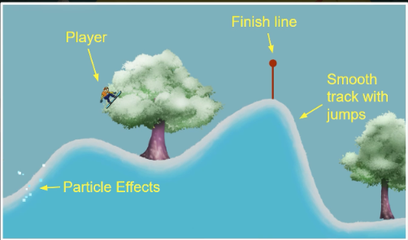

# Snow board

## Description

This is a game where you play as a snowboarder. You have to make flipps and tricks to get the best score and reach the end of the track.

## Game design

### Game mechanics

* Move the snowboarder left and right
* Jump to make flipps and tricks
* Ability to speed up
* Particle effects when player touch the snow
* Finish line to end the level
* Carsh detection wich will reset the player to the start of the level

### Player Experience

* Smooth, relaxing

### Game loop

## Controls

* `A` or `left arrow` - Move left
* `D` or `right arrow` - Move right
* `Space` - Jump
* `R` - Restart level
* `Esc` - Pause game
* `Enter` - Resume game
* `Q` - Quit game
  

## Development steps

[Layout creation](./layout.md)\
[Adding colliders](./colliders.md)\
[Developing The snowboarder](./the_snowboarder.md)